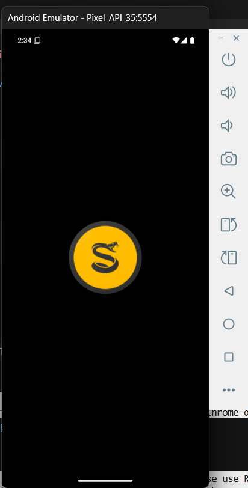
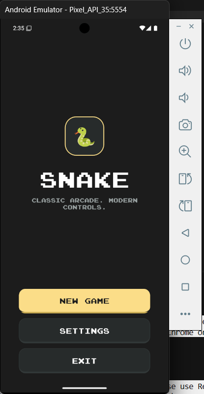
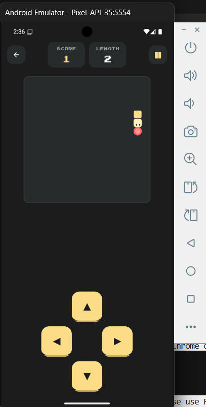
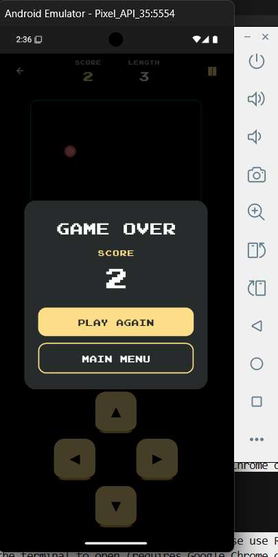
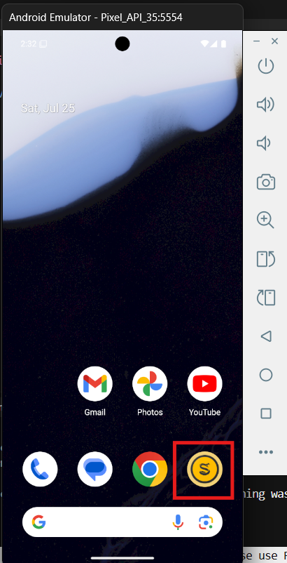

# React Native Snake Game

Classic arcade Snake with modern mobile controls — built with React Native.

<p align="center">
  
  
  
</p>

<p align="center">
  
  
</p>

## Features

- **Board size** — 15×20 or 20×20 grid
- **Difficulty** — Easy, Normal, Hard
- **Color themes** — Yellow, Blue, Green
- **Controls** — On-screen D-Pad or swipe gestures
- **Wall behavior** — Classic game over, or teleport through walls
- **Persistent settings** — Preferences saved with AsyncStorage / MobX

## Screenshots

| Splash | Home | Gameplay | Game over |
| --- | --- | --- | --- |
|  |  |  |  |

## Quick start

**Requirements:** Node.js ≥ 18, JDK 17+, Android Studio / SDK (Android) or Xcode (iOS).

```bash
git clone <repo-url>
cd React-Native-Snake-Game
npm install
```

### Android

```bash
npm start          # Metro (separate terminal)
npm run android
```

### iOS (macOS)

```bash
cd ios && pod install && cd ..
npm start
npm run ios
```

For full environment setup, architecture notes, and troubleshooting, see **[DEVELOPER_GUIDE.md](DEVELOPER_GUIDE.md)**.

## Stack

| Area | Choice |
| --- | --- |
| Framework | React Native 0.76 |
| Language | TypeScript |
| State | MobX + mobx-persist |
| Navigation | React Navigation (stack) |
| Game loop | react-native-game-engine |
